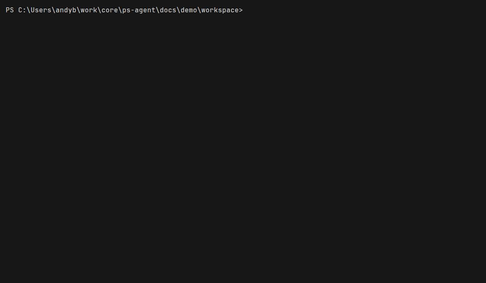

# ps-agent

Two PowerShell cmdlets that put an agent in your terminal, both rendered through
[`Show-Styled`](../ps-bash)'s Strata stylesheet cascade:

| Cmdlet | Alias | What it is |
|---|---|---|
| `Invoke-Agent` | `agent`, `pia` | A **minimal coding agent** — a model, four tools, and a loop. The `pi` shape, in C#. |
| `Invoke-Acp` | `acp` | An **Agent Client Protocol client** — drives Claude Code, Gemini or Codex as a subprocess. |

Both emit the same `PsAgent.AgentEvent` objects, so the transcript is a pipeline, not just a screen.



*`Invoke-Acp -Agent opencode` — the prompt typed into the viewer, thought / tool / answer rows
streaming in, a row expanded. Recorded with [VHS](https://github.com/charmbracelet/vhs); see
[`docs/demo`](docs/demo).*

```powershell
Invoke-Agent "why does the parser drop trailing newlines?"
Invoke-Acp -Agent claude "add a regression test for the trailing-newline bug"

# ...and the same transcript, as objects
Invoke-Agent "audit the error paths" -NoUi | Where-Object Kind -eq ToolCall
Invoke-Agent "audit the error paths" -NoUi | Show-Styled
```

## Why two cmdlets

They answer different questions. `Invoke-Agent` owns the loop — you can see every tool, every
prompt, every token, and change any of it. `Invoke-Acp` owns none of it — it is a front end for
agents other people wrote, which is the only way to drive Claude Code and Gemini from the same
keybindings. Sharing the transcript model between them is what makes that pair worth having:
one renderer, one stylesheet, one set of keys.

## Install

This repo builds against two siblings, by **relative path** — clone all three next to each other:

```bash
git clone https://github.com/standardbeagle/ps-bash
git clone https://github.com/standardbeagle/strata
git clone https://github.com/standardbeagle/ps-agent
```

```
core/
├── ps-bash/     ← ProjectReference: Show-Styled, BashRuntime.RunChildProcess
├── strata/      ← the CSS cascade, consumed from strata/local-feed
└── ps-agent/    ← this repo
```

Strata is not on nuget.org yet, so its local feed has to be packed first:

```bash
cd ../strata && ./scripts/pack-local.sh      # populates ../strata/local-feed
cd ../ps-agent && dotnet build -c Release -m:1
```

The build auto-detects the feed and the Strata version, so a strata bump needs no edit here. A
missing feed fails with that instruction rather than a wall of `CS0246`.

Then import the built module:

```powershell
Import-Module ./src/PsAgent.Cmdlets/bin/Release/net10.0/PsAgent.psd1
```

`Invoke-Agent` resolves a credential in a fixed order and says which step won as the first
transcript row. `-ApiKey`, then `ANTHROPIC_API_KEY` / `ANTHROPIC_AUTH_TOKEN`, then a gateway key
or `ANTHROPIC_API_KEY` in the workspace's `.env.local`, then an `anthropic` key in another CLI's
credential store, then the SDK's own lookup ending at an `ant auth login` profile. An unset
environment variable does not mean unauthenticated.

Any endpoint serving the Anthropic Messages API works, which is how a gateway subscription drives
the direct-API path. Verified end to end:

```powershell
Invoke-Agent "fix the bug in calc.py" `
  -BaseUrl 'https://openrouter.ai/api' `
  -Model 'anthropic/claude-sonnet-4.6'
```

Give the base **without** a version segment — the SDK appends `/v1/messages` itself.

`Invoke-Agent` speaks two wire formats, chosen by `-Api`: the Anthropic Messages API, or the
OpenAI-compatible `/chat/completions` shape that most other services expose. `auto` follows the
credential, because **Anthropic restricts its OAuth to Claude Code** — so a browser sign-in
obtained by anything else belongs to an OpenAI-compatible service, and that is where it can be
spent. Verified against OpenRouter with real tool calling:

```powershell
Invoke-Agent "fix the bug in calc.py" -Api openai `
  -BaseUrl 'https://openrouter.ai/api/v1' -Model 'openai/gpt-4o-mini'
```

The one browser sign-in that needs no setup at all:

```powershell
Connect-Agent -Provider openrouter    # no client id, no app registration
Invoke-Agent "fix the bug in calc.py" -Model 'openai/gpt-4o-mini'
```

OpenRouter's PKCE flow takes no `client_id`, so ps-agent ships it as a built-in profile. OpenAI's
"Sign in with ChatGPT" is an interest-form programme, so that one needs a `client_id` they issue
you; Anthropic's OAuth is Claude Code only. With a `client_id` from any provider, put it in a
profile and the standard flow handles the rest.

`Connect-Agent` signs in through the browser when you would rather not manage a key at all —
an authorization-code flow with PKCE and a loopback redirect, run by ps-agent itself:

```powershell
Connect-Agent -ShowExample           # the provider profile shape
Connect-Agent -Provider my-provider  # opens the browser, stores and refreshes the token
Connect-Agent -List
```

The provider profile carries the `clientId`, because a public OAuth client is an identity the
provider issues to a named application: ps-agent ships the mechanism, you supply the identity you
are entitled to use.

Discovery reads API keys, never sign-in tokens: an OAuth entry in a credential store was issued to
a different application, so ps-agent lists it by name to explain the skip and does not read it.
`-NoCredentialDiscovery` turns discovery off. Keep keys in `.env.local`, which this repo
gitignores.

`Invoke-Acp` needs whichever agent you point it at. The known names shell out through `npx`:

| `-Agent` | Runs |
|---|---|
| `claude` | `npx -y @zed-industries/claude-code-acp` |
| `gemini` | `npx -y @google/gemini-cli --experimental-acp` |
| `codex` | `npx -y @zed-industries/codex-acp` |
| `opencode` | `opencode acp` — ACP is a subcommand of its own binary, not an npx package |

Anything else is treated as an executable on `PATH` that speaks ACP on stdio:

```powershell
Invoke-Acp "..." -Agent my-agent -ArgumentList '--stdio'
```

**Verified against opencode 1.18.18**, which is the easiest one to try since it needs no npx
download:

```powershell
Invoke-Acp "Read hello.txt and tell me the magic word." -Agent opencode -NoUi -AutoApprove
```

One cosmetic quirk worth knowing, since it looks like a bug here and is not: opencode sends
tool-call titles with the drive letter stripped (`Users\andyb\...` rather than `C:\Users\andyb\...`).
That is the agent's own text, passed through verbatim.

## The UI

A live transcript on the alternate screen, one row per event, expandable:

```
ps-agent · claude-opus-5 · C:\work\core\ps-bash
› fix the off-by-one in Window()
· considering the two clamp branches
⚙ read_file src/…/TranscriptView.cs
✔ read src/…/TranscriptView.cs (9214 chars)
⚙ edit_file src/…/TranscriptView.cs
✔ edit src/…/TranscriptView.cs
⚙ $ dotnet test --filter Window -> exit 0
● Fixed. The clamp used total-window as an inclusive bound; …

[7/7] done · 18422 in / 1204 out tokens
↑↓/jk move · Enter expand · i prompt · Esc/q quit
```

| Key | Does |
|---|---|
| `↑` `↓` / `k` `j` | Move the cursor. Moving off the newest row stops the view chasing new output. |
| `Enter` / `Space` | Expand the focused row — full message, tool arguments, command output. |
| `g` / `G` | Jump to the oldest / newest row. |
| `i` or `/` | Type the next prompt. |
| `Esc` | Interrupt the running turn; quit when idle. |
| `q` | Quit. |

Colour comes from `styles/agent.pcss`, the same `.pcss` dialect ps-bash's sheets use. Drop a
`agent.pcss` in `~/.config/ps-agent/styles/` to re-theme without rebuilding, or pass
`-Css` a name, an inline rule, or a path. Every row also carries a glyph, so the transcript still
reads under `NO_COLOR` or in a pipe.

Redirected output, or `-NoUi`, skips the viewer entirely and writes `PsAgent.AgentEvent` objects.

Piping those into `Show-Styled` works unconfigured — the rows carry the `Name` and `class`
properties it reads by default — but it auto-picks ps-bash's generic `object` sheet, since it does
not know this module's kind. Point it at the agent sheet to get the transcript colours:

```powershell
Invoke-Agent "..." -NoUi | Show-Styled ./src/PsAgent.Cmdlets/styles/agent.pcss
```

## Safety

`Invoke-Agent` edits files and runs commands, so:

- **Paths are confined** to `-WorkspaceRoot` (default: the current location). `../../.ssh/id_rsa`
  is refused by the executor, not by the prompt.
- **Mutating tools ask first.** `edit_file` and `run_bash` go through an approval gate rendered in
  the viewer. `-AutoApprove` turns it off.
- **Without a terminal and without `-AutoApprove`, mutating tools are refused** — a prompt that
  cannot be shown cannot be answered, and a silent yes is the one default a tool that edits files
  must not have.
- **Commands are bounded**: `-CommandTimeoutSeconds` (default 120), then the whole process tree is
  killed. Output is clamped so one runaway command cannot fill the context window.

`Invoke-Acp` applies the same path confinement to the `fs/*` callbacks the agent makes — it is a
separate process, and its idea of what it may touch is not this client's.

## Parameters worth knowing

```powershell
Invoke-Agent "..." `
  -WorkspaceRoot ./src `      # what the agent may touch
  -Model claude-opus-5 `      # default
  -EffortLevel medium `       # low | medium | high (default) | max
  -MaxTurns 40 `              # ceiling on model round-trips per turn
  -CommandTimeoutSeconds 120 `
  -AutoApprove `
  -NoThinking `               # hide reasoning rows
  -NoUi                       # objects, no viewer

Invoke-Acp "..." `
  -Agent claude `
  -ArgumentList '--verbose' ` # appended to the agent's command line
  -ShowAgentLog `             # surface the agent's stderr as rows
  -ConnectTimeoutSeconds 60
```

## Development

```bash
dotnet build -c Debug -m:1                                  # always -m:1, see CLAUDE.md
dotnet test src/PsAgent.Cmdlets.Tests --no-build
```

The ACP client has an end-to-end test against `fixtures/stub-acp-agent.js`, a dependency-free Node
agent — so the handshake, framing, streamed updates and agent-to-client callbacks are covered with
no ACP agent installed, no network, and no API key. Those tests self-skip when node is absent.

Documentation site: **https://dev.standardbeagle.com/ps-agent/** (source in [`docs/`](docs), built
by ps-agent itself — see [`docs/demo`](docs/demo)).

Design notes: [`docs/specs/agent-loop.md`](docs/specs/agent-loop.md),
[`docs/specs/acp-client.md`](docs/specs/acp-client.md).

## Known gaps

- **`run_bash` can leave a daemon holding the workspace open.** When `ps-bash` is on PATH the
  tool spawns it, and the `ps-bash-host` daemon it starts outlives the command. Twice that daemon
  kept a handle on the workspace directory, so deleting it afterwards failed, and once it
  inherited the caller's stdout and held a redirected pipe open past exit. The command itself
  completes normally; only cleanup is affected.
- **The permission chooser is covered only by the stub agent.** opencode never sent
  `session/request_permission` in any run, so that branch has not been exercised against a real
  agent.
- **The agent loop is non-streaming.** Each turn is one `Messages.Create`, which keeps the
  assistant echo (thinking signatures, tool_use inputs) exact. The viewer shows a live status row
  so a long turn does not read as frozen, but prose does not appear token by token. See the spec
  for what streaming would require.
- **ACP terminal callbacks are not implemented.** The client advertises `terminal: false`; agents
  that would use it fall back to their own execution.
- **"Allow everything this session"** in the approval chooser behaves as a single allow.
  `-AutoApprove` is the durable form.
